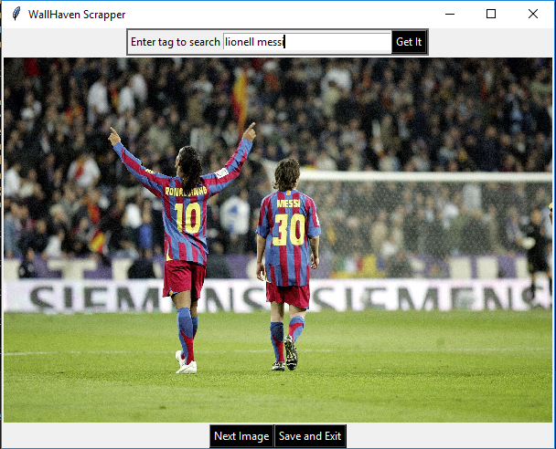

# WallHaven-Scrapper
##### A web scrapper that downloads a random wallpaer of the given tag from https://alpha.wallhaven.cc/

## Pre-requisites
* BeautifulSoup4
* Requests
* Tkinter

## Steps
* ### Clone the source
    `$ git clone https://github.com/salif-04/WallHaven-Scrapper/`
* ### Navigate to the directory
    `cd WallHaven-Scrapper/Gui`
* ### Execute the program
    `$ python3 alphaGui.py`

## Screenshot

